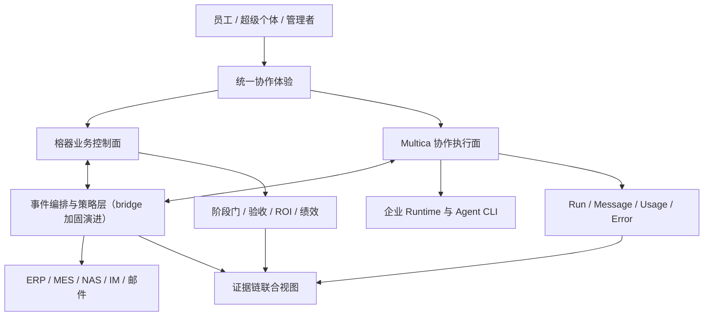
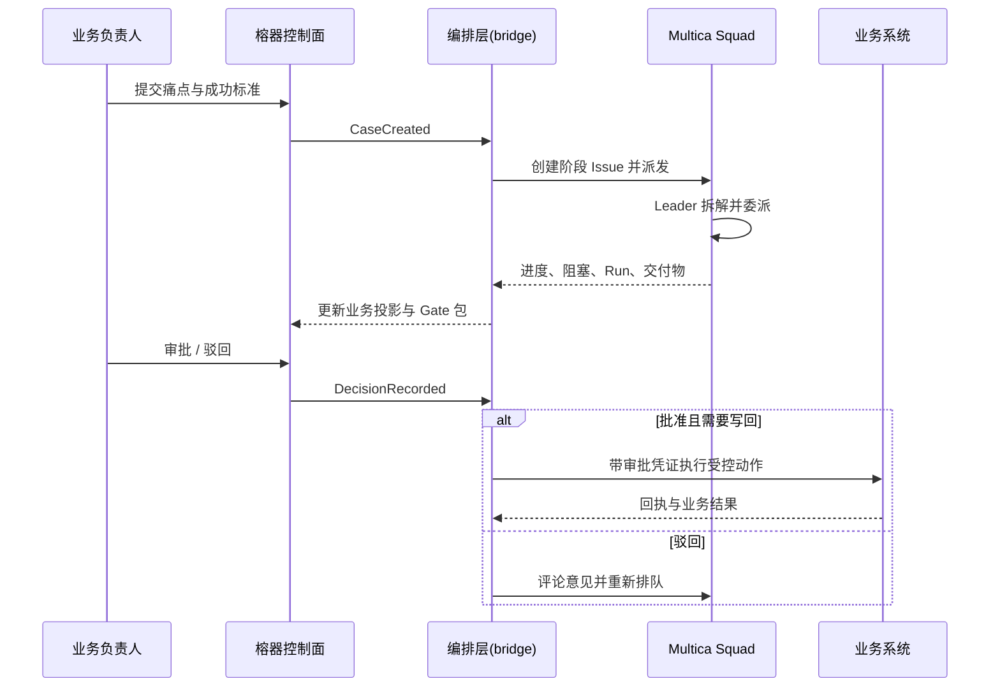

# 聚杰电器 AI Native 协作系统重构方案（修订版 v2）

> 基于《AI数智化企业应用推广行动方案 V4》、`01men/AI-Plan` 当前 `main`（`e79e1f2`）及 `multica-ai/multica` 当前 `main`（`364462c`）审查形成
> 设计基线：2026-08-06；**v2 修订：2026-08-07**，修订要点见附录 A
> 目标不是重做一个项目管理平台，而是建立"人类负责意图、授权与验收，Agent 负责持续执行与组织协同"的企业操作系统。

## 0. 执行摘要

### 核心结论

现有 AI-Plan 已经完成了一个较完整的制造企业业务控制面：组织、数字员工、场景、N01–N40 项目流程、G1–G4 阶段门、任务审核、知识库、治理、激励、费用和 KPI 都已建模；但 Agent 执行仍以同步 LLM/模板和一个外置 CLI bridge 为主。它能展示"数字员工"，还不能稳定运营"数字组织"。

建议保留 AI-Plan 中不可替代的制造企业语义，将 Multica 升格为统一的 Agent 协作与运行底座：

- **榕器业务控制面**：负责战略组合、组织、业务场景、价值基线、阶段门、数据分级、财务核验、绩效与最终验收。
- **Multica 协作执行面**：负责 Agent、Squad、Issue、Project、Skill、Runtime、Run、Autopilot、评论协作、阻塞升级、成本与执行审计。
- **企业集成与策略面**：负责事件编排、身份映射、NAS/ERP/MES/钉钉连接、最小权限、数据脱敏和有审批的写回。
- **统一体验层**：业务用户只面对"我的工作/协作/审批/知识/成效"；管理员才进入 Agent、Runtime、Skill 和策略配置。**重构全程不改变普通员工已验收的交互习惯**（见第 10 节）。

不建议继续扩大当前 `multica-platform` 的轮询桥接器为独立新服务，也不建议把 Multica 源码直接嵌入 FastAPI。正确方向是：**逐步把任务执行真相迁移到 Multica，榕器只保留业务对象、审批与价值真相；在现有 bridge 基础上做事件驱动的增量加固，维护两者的业务投影。**

### v2 的两条前置判断（新增）

1. **Multica 底座能力尚未实证**：截至修订日，本机未安装 Multica CLI，bridge 全部测试基于 mock CLI，真实 workspace/Agent UUID 端到端联调仍是未完成的外部条件。本方案的一切 Squad/Autopilot/权限/用量设计，必须以"第 0 步真实冒烟通过"为前提，不得提前投入。
2. **Multica 商业授权法务确认是准入门槛**：本项目面向第三方商业交付，许可边界必须在架构押注前书面确认，而非规模化阶段再补。

## 1. 审查范围与事实基线

### 1.1 V4 行动方案约束

V4 明确了以下硬约束：

- 2026 年 8–12 月三阶段推进：筑基、推广、深化。
- 首批 5 个重点场景，覆盖产品营销、智造、研发、质量、战略五大平台。
- 业务部门负责价值和场景自研；数字化平台/教练团负责底座、带教、审查和门禁。
- N01–N40 共 40 个项目节点，其中 Agent 主导 24 个、人机协同 9 个、人类主导 7 个。
- G1 立项、G2 方案、G3 试点、G4 结项四个阶段门不可跳过。
- 写回正式系统、敏感数据、生产发布、高风险输出必须人工授权并留痕。
- KPI 不只看项目数量，还要看连续活跃、效率、质量、财务收益和跨部门复用。

因此，新系统必须以"业务阶段门 + 执行证据 + 价值核验"为主轴，不能只是一块 Agent 看板。

### 1.2 AI-Plan 当前能力

仓库当前包含两个子系统：

| 子系统 | 当前定位 | 已有能力 | 主要限制 |
|---|---|---|---|
| `agent-platform` | 企业业务控制面 | FastAPI + SQLite + 原生 SPA；组织、65 个数字员工、232 个场景容量、N01–N40、治理、知识、KPI、模型与 IM 配置 | 单体、SQLite、前端大文件、同步/模板式执行；任务、Agent 和知识模型与 Multica 重复 |
| `multica-platform` | 外部运行时桥接 | Agent 绑定、Issue 创建、状态轮询、交付回传、审批反写、幂等事件账本 | 手工 dispatch、30 秒轮询、单任务单 Agent、一对一绑定、SQLite、依赖 CLI 输出形状、未利用 Squad/Autopilot/权限与用量能力、**未经真实环境验证** |

当前实现有值得保留的安全原则：

- Multica 的 `done` 只进入榕器"待审核"，不能自动变成"已通过"。
- 外部事件有幂等键，CLI 使用参数数组且 `shell=False`。
- 生产模式关闭演示登录，模型和 IM Secret 加密落库。
- 核心业务写回坚持人在环路。

**同样值得保留的既有资产（v2 新增，重构不得破坏）**：

- bridge 已有的幂等事件账本、一对一绑定防重、驳回重做闭环、审批反写。
- 榕器的模板/演示降级引擎（`engine._demo_chat_reply`）：离线演示与客户现场验收的命脉。
- 经 7 轮验收打磨的前端体验：三区协作空间、五列任务看板、staff 最小化导航、浏览器 console 零错误。
- 全量审计 + `llm_calls` 留痕 + 交付卡片 `model_info` 的执行留痕体系。
- 65 个数字员工台账及其挂载的组织、KPI、激励体系（客户已验收资产）。
- 8 角色真实 API 回归脚本（32/32）与平台自动化测试套件（40/40）、bridge 测试（5/5）。

### 1.3 Multica 可直接复用的底座能力（待实证）

基于 Multica 仓库源码审查，可确认其**设计与类型层面**具备以下能力；但**本环境从未真实调用过**，下表每一项在投入前都需在冒烟阶段验证（验证项见第 11 节步骤 0）：

| Multica 能力 | 对本项目的价值 | 冒烟验证点 |
|---|---|---|
| Workspace / Project / Issue | 承载企业域、行动组合、场景项目和可执行工作单元 | CLI 建 Issue、指派、状态流转 |
| Agent + 20 类 CLI Runtime | 让 Codex、Kimi、Qwen 等成为可运营的数字同事 | Kimi CLI 真实跑通一个 Issue |
| Squad（leader + agent/member） | 多 Agent 小队拆解、委派、汇总、闭环 | Squad 创建与子任务委派 |
| Issue assignee 支持 member / agent / squad | 同一工作对象可由人、单 Agent 或 Squad 承担 | 三类 assignee 分别指派 |
| Autopilot（schedule/webhook/api） | 周报、稽核、预警等持续工作无需人工催办 | schedule 触发一次真实运行 |
| Agent invocation permission / runtime visibility | 按 owner、workspace、member 控制调用与绑定 | 越权调用被拒绝 |
| Task/Run/Message/Usage/Failure | 逐次运行证据、Token/成本、错误、重试 | CLI 输出形状与 bridge 解析对齐 |
| Skill | 成功交付固化为可复用标准作业 | Skill 元数据可读取 |
| Daemon + 自有 Runtime | 代码与敏感文件留在企业机器/NAS 邻近环境 | daemon 在线执行 |
| Inbox / Channels | 只在需要决策或解除阻塞时通知人 | 通知触达 |
| webhook / 事件推送 | 替代轮询，降低延迟与调用量 | bridge 能接收真实事件 |

## 2. 当前方案的关键风险

### P0：两套执行真相导致状态漂移

榕器有任务状态，Multica 也有 Issue/Run 状态；bridge 通过轮询进行映射。网络失败、重复运行、人工在两边改状态、交付物延迟出现时，都可能形成"本地待审核、外部仍运行"或"外部完成、本地无交付"的分叉。

**决策**：Multica 成为执行状态、运行记录和讨论的唯一真相；榕器只保存业务状态投影与审批结论。**过渡期界面只向用户展示业务投影状态**，不暴露两套状态机（见 10.3）。

### P0：现有 bridge 不能支撑多 Agent 组织

当前 `bindings` 是 `local_agent_id -> external_agent`，`runs` 是 `local_task_id -> external_issue`。这无法表达一个场景由 PM Agent、业务分析 Agent、开发 Agent、QA Agent、数据安全 Agent 并行协作，也无法表达 leader/worker、子任务和依赖关系。

**决策**：绑定对象从"数字员工"升级为"角色模板/Agent/Squad/能力策略"；任务映射升级为业务 Case 与 Multica Project/Issue/Run 的一对多关系——**以 bridge 的表结构演进实现，不新建服务**（见 3.3、11.2）。

### P0：业务任务与代码 Agent 的能力边界未显式区分

Multica 擅长驱动 CLI Agent，但外贸跟单、BOM、8D、排产预警还需要 ERP/MES/NAS/IM 等工具与数据策略。仅创建 Issue 并分给 Codex/Kimi，不等于具备业务执行能力。

**决策**：所有数字员工采用"角色 + Skills + Tools/MCP + Data Scope + Write Policy + Runtime"六段式定义；没有受控工具就只能给建议，不能宣称完成业务动作。

### P0（v2 新增）：Multica 能力未实证即大规模投入

在真实 CLI、daemon、Squad、Autopilot 未跑通前，按其文档能力设计上层组织，存在整体返工风险；CLI 输出形状变化可直接打断 bridge 的交付提取。

**决策**：真实冒烟与法务确认作为阶段准入门槛（gate-in），未通过不启动后续建设。

### P1：可靠性和生产运维不足

- 轮询放大延迟和调用量；缺少退避重试、死信和可重放事件。
- bridge 与业务平台使用 SQLite，**当前单机单客户规模不是瓶颈**（v2 修正原判断）；多实例、高并发和灾备时再迁 PostgreSQL。
- `latest_run_id` 与末段文本拼接式交付提取容易受 CLI 输出顺序和消息结构变化影响——**冒烟阶段必须实测对齐**。
- 手工 `dispatch(task_id)` 不是 AI Native：系统不能基于阶段门、规则或事件自主触发。**同时，轮询延迟叠加 CLI 执行耗时会造成体验断层，事件推送是体验条款而非纯可靠性条款**（见 10.1）。

### P1：治理是"台账功能"，尚未进入每次 Agent 运行

V4 的 L1–L4 数据密级、六大红线、Token 报销、人工确认写回等，目前主要存在于业务平台页面和制度中；需要变成每次任务派发前的机器可执行策略。

### P2：指标容易被"自动化数量"绑架

流程数字化覆盖率若没有连续使用、质量、返工、财务收益和停用机制，会鼓励创建更多无人使用的 Agent。应以 Outcome 而非 Agent 数量衡量成功——**但落在榕器现有 KPI 框架上，不另建看板**（见第 9 节）。

## 3. 目标系统：三平面、一证据链



### 3.1 榕器业务控制面：回答"为什么做、是否生效"

保留并强化：

- 战略目标、五大平台、部门与人员责任。
- 场景机会池、痛点、基线、预期收益、风险分级。
- Program / Initiative / Case 业务对象。
- N01–N40 模板及 G1–G4 阶段门。
- UAT、上线许可、最终验收、财务核验、激励与退出。
- 数据分级、系统写回审批和业务责任归属。

降级或调整（v2 修正）：

- **执行引擎不删除**：`engine.py` 的模板/LLM 同步执行降级为"离线/演示/Multica 不可用"的兜底路径，与现有 `execution_mode` 留痕对齐；这是离线演示能力和故障降级的双重保险。
- 重复的 Agent 运行状态机逐步让位于 Multica 投影；通用聊天/运行消息的主存储迁移到 Multica，榕器只存摘要与引用。
- 与 Multica 重复的模型、Runtime、Skill 运行配置逐步迁移，业务身份与 KPI 仍留榕器。

### 3.2 Multica 协作执行面：回答"谁在做、做到哪里、花了多少"

- 一个企业 Workspace，可按数据隔离要求拆分为"通用协作""研发受限""财务受限"等 Workspace。
- 五大平台对应 Project Portfolio；每个场景对应一个 Project 或父 Issue。
- Issue 是最小可执行与可审查单元；复杂场景分解为父子 Issue/关联 Issue。
- Squad 负责复杂工作的自主拆解与协同；单 Agent 负责标准化窄任务。
- Autopilot 负责周期性或事件驱动任务。
- Run、Message、Usage、Failure 是执行事实，不复制回榕器全文，只同步摘要与引用。

### 3.3 事件编排与策略层：bridge 的增量加固（v2 修正，替换原"新建 orchestrator 服务"）

原版方案要求新建独立 `orchestrator` 服务并直接采用 PostgreSQL，实质上是一次大爆炸重写，与自身"旁路演进"原则矛盾。**修订为：在 `multica-platform/app/bridge.py` 基础上分步加固，能力达标而服务不拆**：

- **事件驱动**：接入 Multica webhook/API 事件，自动触发取代手工 dispatch；30 秒轮询降级为兼容兜底。
- **可靠性**：在现有 events 账本上加列实现重试退避、死信标记与事件重放接口；幂等消费保持不变。
- **策略决策（Policy Decision）**：派发前执行调用者、Agent、数据范围、工具、预算、风险、是否需审批的校验——策略数据来自榕器侧的六段式契约与工具分级字典（见 5.3、8.2）。
- **映射升级**：Case–Project–Issue–Run 一对多映射作为 bridge 表结构演进（新表/新列），关联 ID 全局唯一。
- **业务投影**：将 Multica 执行摘要映射为榕器业务投影；不复制完整聊天历史。
- **写回授权**：对 ERP/MES 写回生成"拟执行动作"，必须经授权后由专用 Action Executor 执行。
- **PostgreSQL 推迟**：当前单机单客户规模 SQLite 足够；进入多实例/多客户阶段（第 11 节步骤 5）再评估迁移，届时事件账本 schema 已定，迁移成本低。

**归属约定（v2 新增，维持仓库分治）**：加固后的 bridge/编排层归 `multica-platform/` 侧维护；榕器侧唯一新增是"领域事件外发"（CaseCreated、DecisionRecorded 等 outbox 端点），遵循先改 `agent-platform/API.md` 再加端点的既有契约流程。

### 3.4 一条不可抵赖的证据链：联合视图而非第三套账本（v2 修正）

每个业务 Case 使用全局 `case_id` 串联：

`战略目标 -> 场景 -> 基线 -> 阶段门 -> Multica Project/Issue -> Agent Run -> 数据/工具调用 -> 交付物 -> 人工决策 -> 上线效果 -> 财务核验 -> Skill 版本`

**不新建独立证据账本**。证据链 = 榕器现有审计表 + `llm_calls` 留痕 + bridge 幂等事件账本的**联合查询视图**，以 `case_id` 为串联键；敏感正文仍留在权威系统，视图中只存不可变事件摘要、哈希、主体、时间、策略结果和源对象引用。

## 4. 业务对象与 Multica 映射

| V4 / 榕器对象 | Multica 对象 | 说明 |
|---|---|---|
| 企业 / 隔离域 | Workspace | 按安全域划分，不按每个部门滥拆 Workspace |
| 五大平台 | Project 分组/标签 | 用统一属性标记平台、部门、风险和波次 |
| 数智化行动组合 | Project / Portfolio 投影 | 汇总预算、收益、进度和阻塞 |
| 单个业务场景 | Project 或父 Issue | 4–10 周复杂场景用 Project；一次性小优化用父 Issue |
| N01–N40 节点 | Issue 模板 + 自动化规则 | 只实例化当前阶段必要节点，避免一立项就制造 40 张空卡 |
| G1–G4 阶段门 | 榕器 Approval + Multica gate Issue | 榕器是审批真相；批准事件解锁下一批 Issue |
| 数字员工 | Agent | **双层模型（v2 新增）**：展示/治理层 65 个数字员工身份不变（组织、KPI、激励照常挂载）；执行层由 Agent/Squad 承接，一个 Squad 可服务多个数字员工身份的派单 |
| 跨职能数字团队 | Squad | leader 负责拆解、委派、汇总、阻塞升级；对业务界面不可见，仍呈现为"数字员工" |
| 标准作业 | Skill | 必须经人工审核、版本化、标注适用范围和风险；元数据可同步回榕器 Skill 库 |
| 心跳/日报/稽核 | Autopilot | schedule、webhook、api 三类触发；替代/增强现有 6 小时 asyncio 心跳 |
| 人工审核 | 榕器 Decision | Multica `in_review` 触发，结论回写评论与状态 |
| KPI / ROI | 榕器 Outcome 指标列 | 汇总 Multica usage/run 与业务系统真实结果，**接入现有 `/api/metrics` 与驾驶舱** |

## 5. Agent 组织设计

### 5.1 企业级核心 Agent

| Agent / Squad | 主要职责 | 典型触发 | 必须人工决定 |
|---|---|---|---|
| Portfolio Steward | 行动组合、里程碑、跨项目风险、管理简报 | 每日/每周 Autopilot | 战略优先级、预算调整 |
| PMO Squad | 立项材料、WBS、依赖、周报、风险、阶段门材料 | Case 创建、进度事件 | G1–G4 签核 |
| Solution Architect | 需求澄清、架构、接口、非功能要求 | G1 通过 | 重大方案与数据边界 |
| Security & Data Steward | 数据分级、最小权限、脱敏、工具策略检查 | 每次派发前/方案评审 | L3/L4 例外授权 |
| QA & Evaluator | 测试集、离线评测、回归、幻觉/准确率核验 | 开发完成、版本变化 | UAT 与放行 |
| Value Auditor | 基线、节省工时、质量、财务收益证据 | 月度/结项 | 财务确认、奖金结算 |
| Knowledge Curator | 文档清洗、元数据、过期检测、Skill 候选提炼 | 文档入库/项目结项 | 高密级发布、Skill 发布 |
| Integration Operator | 受控读取/拟写回 ERP、MES、NAS、IM | webhook/API | 正式写回与外发 |

### 5.2 五类业务 Squad：执行层聚焦，展示层不变（v2 修正）

原版"首批不应创建 65 个万能数字员工"的表述易被读成推翻已验收资产。**修正为双层模型**：65 个数字员工作为客户可见的组织身份与考核对象**保留不动**；执行层首批只建设 5 个可度量的业务 Squad，按部门/场景承接 65 个身份的派单：

1. **外贸履约 Squad**：订单提取、合同条款检查、ERP 草稿、标签生成、发货跟踪；写 ERP/对外邮件需确认。
2. **智造运营 Squad**：会议纪要、待办、OPL、日报周报；排产/缺料阶段只读，建议由人确认。
3. **BOM 工程 Squad**：ERP/图纸/BOM 三向比对、变更影响分析、物料预警；BOM 正式变更需工程签核。
4. **质量闭环 Squad**：异常结构化、相似案例、8D 草稿、验证跟踪；根因与纠正措施由质量负责人承担。
5. **经营治理 Squad**：覆盖率、费用、收益、培训与运营看板；财务数据按受限 Workspace/Runtime 处理。

每个 Squad 至少包括：`Leader/Planner`、`Domain Worker`、`Data/Tool Operator`、`Reviewer/Evaluator`；人类业务负责人作为 member 参与，不让 Agent 互相"自审通过"。

### 5.3 Agent 六段式配置契约

```yaml
role: 外贸跟单执行员
skills: [order-intake-v1, contract-check-v2, shipping-track-v1]
tools: [mail-read, nas-order-write, erp-order-draft]
data_scope: [sales/international/L2, customer/pii-masked]
write_policy:
  mail-send: human_approval
  erp-draft: human_confirm
  erp-post: forbidden
runtime: sales-secure-runtime
```

Agent 的名称或提示词不能代替权限；策略层必须根据上述契约在运行前生成短期凭证和最小数据上下文。**六段式契约的数据模型落在榕器数字员工档案上**（扩展现有技能/MCP 绑定字段），由 bridge 在派发前读取执行校验。

## 6. N01–N40 的 AI Native 化

### 6.1 不机械创建 40 张卡，而是按阶段展开

| 阶段 | 自动创建的执行包 | Agent 行为 | 人类责任 |
|---|---|---|---|
| 启动 N01–N08 | 痛点澄清、可行性、数据/风险、ROI、立项包 | PMO Squad 汇总证据并生成 G1 包 | 提痛点、确认责任人、G1 批准 |
| 设计 N09–N16 | 需求、验收集、架构、接口、预算 | Architect + Data Steward 并行，PMO 汇总 | 确认验收标准、G2 批准 |
| 开发 N17–N24 | MVP、Skill、连接器、测试、培训 | Build Squad 执行，QA 独立评测 | 提供样本、处理重大变更 |
| 试点 N25–N32 | 部署、UAT、反馈、收益初核 | Autopilot 收集使用与错误，Agent 修复 | 真实使用、G3 评估 |
| 结项 N33–N40 | 验收、归档、Skill 发布、财务与推广 | Curator + Value Auditor 形成结项包 | 签验收、G4 批准、表彰 |

### 6.2 阶段门机制

每个 Gate 由结构化 Gate Packet 驱动（**在榕器现有 G1–G4 阶段门上扩展字段实现**）：

- `decision`: approve / reject / conditional
- `evidence_refs`: 基线、测试、Run、交付物、审计引用
- `risk_exceptions`: 例外、责任人、失效时间
- `conditions`: 附条件批准的后续任务
- `signer`: 具名人类责任主体

Gate 未通过时，编排层不创建下一阶段的执行 Issue；条件批准只释放满足策略的子任务。

### 6.3 典型闭环



## 7. 首批五场景的落地方式

| 场景 | 第一版自动化边界 | Multica 组织方式 | 核心验收指标 |
|---|---|---|---|
| 外贸跟单 | 邮件/钉钉提取、资料归档、ERP 草稿、合同检查；不自动提交订单 | 外贸履约 Squad + 事件 Autopilot | 关键字段准确率≥95%；处理工时降≥30%；零未授权写回 |
| 会议纪要/运营 | 转写、纪要、待办、催办、周报；责任人确认后发布 | 单 Agent + 日/周 Autopilot | 待办识别准确率、闭环周期、活跃率≥70% |
| BOM/物料 | 三向差异、影响分析、预警、采购建议；不直接改 BOM | BOM 工程 Squad | 差异召回率/精确率、核对工时、误报率 |
| 质量/8D | 异常结构化、历史匹配、8D 草稿；根因/措施人工确认 | 质量闭环 Squad | 报告时间 2h→≤30m；关键字段≥95%；返工下降 |
| 经营/PMO | 覆盖率、里程碑、成本、收益、月度复盘 | PMO + Value Auditor Autopilot | 数据及时性、财务核验率、风险提前发现率 |

## 8. 数据、工具与安全架构

### 8.1 数据不"搬进一个大知识库"

- NAS 是文档权威源，Multica Project 只引用所需上下文。
- ERP/MES 是结构化业务权威源，通过只读 API、副本或中间层访问。
- pgvector 用于索引与检索，不替代源系统权限与版本控制。
- 每个检索片段带 `source_id / version / classification / owner / expires_at`。
- L3/L4 数据默认不进入第三方云模型；使用本地/专属 Runtime，或先脱敏再调用。

### 8.2 工具分四级

| 级别 | 行为 | 默认控制 |
|---|---|---|
| T0 | 搜索、读取、计算 | 自动，按数据范围审计 |
| T1 | 生成草稿、创建内部待办 | 自动，结果可撤销 |
| T2 | 修改内部正式数据、发送内部消息 | 单次或规则化人工确认 |
| T3 | 对外发送、生产发布、财务付款、删除 | 双人/指定角色批准，短期凭证，完整回执 |

V4 红线直接编码为 deny policy：Agent 不可直连生产数据库、不可绕过审批写正式数据、不可未经评审公网部署、不可把高敏数据发给未获准模型。**T0–T3 字典与六段式契约一样落在榕器侧，由编排层在派发前读取执行**。

### 8.3 身份与责任

- 人类身份统一来自企业 IM/SSO；榕器和 Multica 共享稳定 `person_external_id`。
- Agent 有 owner、创建者、可调用范围、运行时 owner 和 accountable human。
- 每次 Run 记录直接发起人、委派链、Autopilot owner 和最终责任人。
- 离职、转岗或项目结束自动撤销 Agent 调用权、工具凭证和数据授权（与 R7 已实现的离职会话失效机制对齐）。

## 9. KPI 与运营模型

### 9.1 四层指标：落在现有 KPI 框架上（v2 修正）

不另建 Outcome 看板。在榕器现有驾驶舱与 `/api/metrics` 基础上扩充指标列，Multica usage/run 摘要经编排层同步接入：

| 层级 | 指标 | 落地位置 |
|---|---|---|
| Adoption | 周活用户、活跃场景、连续 4 周使用率 | 驾驶舱新增列 |
| Delivery | 周期、阻塞时长、人工等待、重试、成功率 | 任务中心统计 + 驾驶舱 |
| Quality | 准确率、退回率、返工、异常、人工改写比例 | 数字员工指标页（扩展现有近 14 天指标） |
| Outcome | 节省工时、差错下降、避免招聘/外包、财务核验收益、复用部门数 | 现有节省工时/年化效益口径升级为真实核验值 |

Token、成本和 Run 数是约束指标，不是成果指标。静态展示值继续按 R7 口径明确标注。

### 9.2 Agent 运营机制

- **上线**：必须有 owner、Skill、评测集、数据范围、工具策略、预算和回滚方式。
- **观察**：每周自动评估失败率、阻塞、成本、漂移、人工改写和权限异常。
- **晋级**：连续达到质量/使用/价值门槛后，从建议型升级到草稿型，再到受控执行型。
- **退出**：连续两个月低使用、无 owner、收益不达标、风险不可控或能力被更优 Agent 合并时下线。
- **Skill 发布**：成功一次不等于标准化；至少经过独立评测、业务审核、版本说明和适用边界后发布。

## 10. 使用体验设计（v2 新增章节）

重构的用户体验连续性与技术架构同等重要。当前平台经 7 轮验收打磨，以下 UX 条款均为硬约束，纳入每阶段验收。

### 10.1 执行延迟体验：从秒级到分钟级的过渡管理

现状模板引擎秒级出交付物，驳回重做也是秒级；CLI Agent 真实执行是分钟级。若无设计，"驳回→新交付"叠加轮询可能 5–10 分钟，用户会判定系统故障。

**条款**：

- 驳回后 <10 秒界面可见"已重新排队"状态；
- 执行中任务展示进度心跳（Run/Message 摘要滚动可见）；
- 派发后立即回执"已受理 + 预计时长区间"；
- 事件推送（webhook）替代轮询是实现上述指标的**体验条款**，排期不低于可靠性需求。

### 10.2 降级路径：Multica 不可用时的明确体验

- Multica CLI/daemon 离线、未配置或执行失败时，派活自动降级为模板/演示回复，界面明确标注（沿用 `execution_mode` 与 R7 演示回复的既有标注样式），不静默伪装、不硬错误阻断演示。
- 生产模式下保持明确错误提示与重试入口，不用模板冒充真实执行。

### 10.3 状态漂移过渡期的界面策略

- 任务卡片标注单一"执行来源"（本地引擎 / Multica）；
- 界面向用户只呈现业务投影状态（待处理/进行中/待审核/已通过/已驳回五列不变）；执行细节（Issue 状态、Run 列表）收纳进"执行详情"折叠面板，面向管理员与开发者。

### 10.4 概念隔离：保护普通员工视角

- staff（一线使用人）导航项**零增加、零改名**；Squad、Autopilot、Workspace、Runtime 等概念不出现在业务界面文案中，界面语言保持"数字员工""任务""审核"。
- 管理员/开发者才可见 Agent 组织、Runtime、Skill 运行配置与策略配置。
- 每阶段验收以现有 8 角色回归脚本为基线，增加 UX 断言（staff 可见项集合不变、关键页面 console 零错误）。

### 10.5 学习成本单一入口

- 新指标只进现有驾驶舱与数字员工指标页；新能力（执行详情、进度心跳）只进现有任务卡片与协作空间，不新增顶级页面。

## 11. 技术实施路线（v2 重排）

> 总原则：每一步都可独立验收、可回退；不打断在用系统的演示与验收节奏；维持"每轮完成即提交推送、验收报告入 `acceptance/round<N>/`、API.md 同步"的既有约定。

### 步骤 0（1–2 周）：准入——法务确认 + 真实冒烟

**未通过本步骤，不启动后续任何建设。**

1. Multica 商业授权法务书面确认（面向第三方商业交付的许可边界）。
2. 安装 Multica CLI + daemon，取得真实 workspace/Agent UUID（客户侧外部条件）。
3. 用**现有 bridge 能力**跑通一条真实闭环：会议纪要场景、只读工具，榕器任务 → dispatch → 真实 Issue → Kimi/Codex Run → deliverable 回传 → 待审核 → 人工通过/驳回 → 回写 Multica。
4. 实测对齐 CLI 输出形状与 bridge 交付提取逻辑；按 1.3 表逐项登记冒烟验证结果。
5. 记录真实执行延迟分布，为 10.1 的 UX 指标定基线。

**退出条件**：真实闭环全链路可重放；法务书面确认归档；CLI 输出解析契约测试入库。

### 步骤 1（2–3 周）：bridge 事件化加固

1. 接入 Multica webhook/API 事件，自动触发取代手工 dispatch；轮询降级为兜底。
2. events 账本加列：重试退避、死信标记、事件重放接口。
3. 进度消息摘要回传榕器，实现 10.1 的进度心跳。
4. 重复、乱序、超时、重试、驳回重做、运行时离线的自动化契约测试。

**退出条件**：UX 指标达标（驳回 <10s 可见重新排队）；故障注入契约测试全绿；bridge 测试保持全过。

### 步骤 2（2–3 周，可与步骤 1 并行）：六段式契约与工具分级落库（纯榕器侧）

1. 数字员工档案扩展六段式字段（role/skills/tools/data_scope/write_policy/runtime）。
2. T0–T3 工具分级字典 + 派发前策略校验接口（API.md 先行）。
3. 六大红线编码为 deny policy；L3/L4 数据调用拦截。
4. 领域事件外发端点（CaseCreated / DecisionRecorded 等 outbox）。

**退出条件**：无受控工具的 Agent 只能给建议不能宣称完成业务动作；越权派发被机器拒绝并留痕。

### 步骤 3（1–2 周）：Gate Packet 结构化

1. 现有 G1–G4 阶段门扩展 `evidence_refs / risk_exceptions / conditions / signer` 字段。
2. Gate 批准事件经编排层解锁下一批 Issue；条件批准只释放满足策略的子任务。
3. Case–Project–Issue–Run 一对多映射表落地（bridge 侧）。

**退出条件**：Gate 未通过时下一阶段 Issue 不会被创建；条件批准联动有契约测试。

### 步骤 4（4–6 周）：Squad 试点灰度

1. 会议纪要场景从单 Agent 升级为智造运营 Squad（leader 拆解委派）。
2. 外贸履约、BOM 工程、质量闭环 Squad 逐个上线；先读后写，T2/T3 走审批。
3. NAS/ERP/MES 只读连接器；PMO/Value Auditor/Knowledge Curator 上 Autopilot。
4. 双层模型落地：65 个数字员工身份派单按部门/场景路由至 Squad，界面无感知。
5. 真实 UAT 集、离线评测、红队测试；Agent Registry 与 Skill Registry 版本/发布流程。

**退出条件**：首批 5 场景连续运行 4–8 周，周活、准确率、工时与财务证据达到 V4 门槛；staff 视角 UX 断言全过。

### 步骤 5（按需，2026 年 12 月前后）：规模化与标杆固化

1. 财务逐项核验收益，形成可审计 ROI；选 3 个标杆 Skill/Squad 模板跨部门复制。
2. 关闭低使用或高风险试点；形成 2027 年 20+ 应用扩展清单与容量预算。
3. **此时再评估**：PostgreSQL 迁移（多实例/灾备需要时）、多 Workspace 拆分、Skill 市场、跨部门复用收益归因。
4. 面向榕器共享制造平台的多租户边界设计（法务确认已完成的前提下）。

## 12. 建议的代码仓库演进（v2 修正）

近期**不新建 `orchestrator/` 顶层服务、不移动现有目录**：

```text
AI-Plan/
├── agent-platform/            # 榕器业务控制面（Kimi 维护）
│   └── 演进：六段式契约字段、Gate Packet、领域事件外发、UX 条款
├── multica-platform/          # 编排层：bridge 加固演进（GPT 维护）
│   └── 演进：webhook、退避/死信/重放、一对多映射、策略校验、连接器
├── integrations/              # （步骤 4 起）NAS/ERP/MES/IM 适配器与契约测试
├── evals/                     # （步骤 4 起）场景测试集、质量阈值、红队与回归
└── docs/adr/                  # 架构决策记录（ADR-001 起）
```

契约中心仍是 `agent-platform/API.md`；跨侧交接沿用 AGENTS.md 协作留言区机制。

## 13. 优先级 Backlog（v2 重排）

### P0：准入与地基

1. 法务书面确认 + 真实环境单 Agent 冒烟（步骤 0，gate-in）。
2. ADR-001：Multica 是执行真相，榕器是业务/审批/价值真相；bridge 加固取代新建 orchestrator。
3. webhook 事件化 + 退避/死信/重放 + 进度心跳（UX 条款 10.1）。
4. Agent 六段式配置和 T0–T3 工具分级落库（榕器侧）。
5. 会议纪要场景真实 E2E 与故障注入测试。

### P1：试点扩围前完成

1. Gate Packet 与写回授权凭证；Case–Project–Issue–Run 一对多映射。
2. Squad 模板、Autopilot、运行归因和预算上限。
3. 企业 SSO/IM 身份映射与离职撤权（衔接 R7 已有机制）。
4. NAS/ERP/MES 只读连接器及数据血缘。
5. 评测平台、版本门禁、质量回归。
6. UX 条款 10.2–10.5 全部落地并纳入回归。

### P2：规模化能力

1. PostgreSQL、备份恢复、监控告警和运行手册（多实例需要时）。
2. 跨部门 Skill 市场与复用收益归因。
3. Agent 能力晋级/降级和自动停用建议。
4. 场景组合优化、资源容量与模型路由。
5. 面向榕器共享制造平台的多租户边界。

## 14. 验收标准

新系统达到以下条件，才可称为 AI Native 协作系统：

**架构与治理**：

- 人只在意图、例外、风险、资源与阶段门上作决定；常规协调由 Agent 持续完成。
- 一个复杂场景可由 Squad 自主拆解、委派、汇总并上报阻塞，而不是人工逐个派活。
- 每个 Agent 动作都能追溯到人、Case、策略、数据、工具、Run 和成本（证据链联合视图）。
- Agent 的"完成"不等于业务生效；人工 Gate 与受控 Action Executor 决定正式写回。
- 系统故障、重复事件、乱序消息、运行时离线和人工驳回不会造成双执行或状态丢失。
- KPI 能从执行事实走到财务核验，不以 Agent 数或生成内容量充当价值。
- 成功做法能转化为有版本、有评测、有权限边界的 Skill/Squad 模板并跨部门复制。

**使用体验（v2 新增）**：

- 驳回后 <10 秒可见"已重新排队"；执行中任务有实时进度心跳。
- Multica 不可用时演示/离线体验不中断，降级回复明确标注。
- 迁移全程普通员工导航零增加、零改名；业务界面不出现 Squad/Autopilot/Runtime 等术语。
- 用户只面对业务投影状态，无需解读两套状态机。
- 平台自动化、bridge、8 角色回归三套测试持续全绿，浏览器 console 零错误。

## 15. 设计依据

- [AI-Plan 仓库](https://github.com/01men/AI-Plan)：当前业务控制面、桥接层、API 契约与验收体系。
- [Multica 仓库](https://github.com/multica-ai/multica)：Agent、Squad、Autopilot、Issue、Runtime、Skill、权限、运行与用量能力。
- [Multica README](https://github.com/multica-ai/multica/blob/main/README.md)：产品能力、运行架构、自托管与支持的 Agent CLI。
- [Multica Agent 类型](https://github.com/multica-ai/multica/blob/main/packages/core/types/agent.ts)、[Squad 类型](https://github.com/multica-ai/multica/blob/main/packages/core/types/squad.ts)、[Autopilot 类型](https://github.com/multica-ai/multica/blob/main/packages/core/types/autopilot.ts)、[Issue 类型](https://github.com/multica-ai/multica/blob/main/packages/core/types/issue.ts)：本方案映射所依据的当前实现。
- `multica-platform/ARCHITECTURE.md`：既定融合决策与责任边界，本方案与其保持一致并细化。

---

## 附录 A：v2 修订记录（2026-08-07）

相对原版（2026-08-06）的实质性修改：

1. **新增两条前置判断**（执行摘要）：Multica 能力未实证、法务确认前置为准入门槛。
2. **1.2 新增既有资产清单**：bridge 幂等账本、模板降级引擎、已验收前端体验、65 数字员工台账、三套测试基线——重构不得破坏。
3. **1.3 改为"待实证"**：每项 Multica 能力补充冒烟验证点。
4. **第 2 章新增 P0 风险**："未实证即大规模投入"；修正 SQLite 判断（当前规模不是瓶颈，PostgreSQL 推迟）。
5. **3.3 重写**：新建 orchestrator + PostgreSQL 改为 bridge 增量加固（webhook、退避/死信/重放、一对多映射、策略校验），并明确 Kimi/GPT 分治归属。
6. **3.4 重写**：统一证据账本改为现有审计 + llm_calls + 事件账本的 case_id 联合视图，不建第三套存储。
7. **第 4 章映射表**：数字员工行改为双层模型（65 身份展示层不变，Squad 执行层承接）；KPI 行明确接入现有 `/api/metrics`。
8. **5.2 修正**："不应创建 65 个万能数字员工"改写为双层模型表述。
9. **第 9 章**：四层指标落在现有 KPI 框架，不另建 Outcome 看板。
10. **新增第 10 章"使用体验设计"**：执行延迟过渡、降级路径、状态漂移界面策略、概念隔离、单一入口五条 UX 硬约束。
11. **第 11 章实施路线重排**：A/B/C/D 四阶段改为步骤 0–5，新增"步骤 0：法务 + 真实冒烟"准入门槛；PostgreSQL、多 Workspace 移至步骤 5 按需评估。
12. **第 12 章仓库演进**：不新建顶层 orchestrator 服务；integrations/evals 推迟到步骤 4。
13. **第 13 章 Backlog 重排**：法务与冒烟升入 P0；PostgreSQL 降为 P2。
14. **第 14 章验收标准**：新增使用体验验收条款。

---

**最终产品判断**：应把现有平台从"数字员工展示与管理系统"收敛为"企业 AI 业务控制面"，把 Multica 从"可选外部执行器"提升为"Agent 协作操作系统"，再用事件驱动的 bridge 加固与机器可执行治理把两者连接。前提是：先用一次真实冒烟证明 Multica 底座可依赖，先用法务确认扫清商业边界，并在每一步都守住已验收的用户体验。这样既保留 V4 的制造企业落地逻辑，也真正获得多 Agent、自主协同、持续运行、可审计与可规模化复制的能力。
