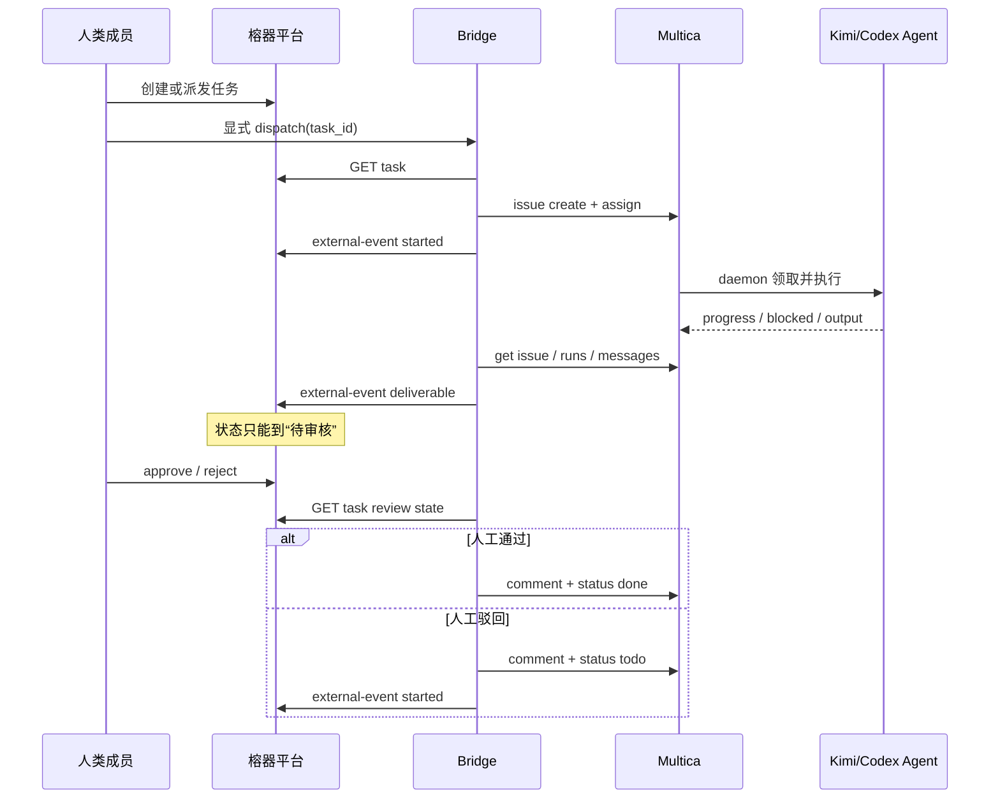

# 人 × Agent 协作架构与 Multica 融合决策

更新：2026-07-20

## 现有平台评估

`agent-platform` 已经形成完整的企业业务控制面：

- 人和数字员工都挂在 5 平台 / 28 部门组织中，数字员工有 owner、技能和 KPI；
- 场景立项会创建协作空间，沟通可转任务；
- 工作区用讨论区、Agent 执行区、私聊打磨区分隔不同协作意图；
- 交付物必须人工审核，驳回重做，通过后才计入绩效；
- 还有费用、激励、审计、知识库和经营指标等企业治理能力。

主要缺口在 Agent 执行层：当前 `engine.py` 是同步模板/可选 LLM 文本生成，不具备真实 CLI Agent 的任务领取、隔离工作目录、长任务进度、阻塞、执行历史、并发运行时和跨任务技能沉淀。

## Multica 能补什么

[Multica](https://github.com/multica-ai/multica) 把 Agent 当作可指派的团队成员，提供 issue 生命周期、Agent daemon、本地/云运行时、执行消息、autopilot、skills、workspace 和 squad。官方 CLI 已覆盖 workspace、issue、runs、run-messages、usage、agent 和 autopilot，并原生识别 Kimi、Codex 等 CLI Agent。

它的技术栈是 Next.js + Go + PostgreSQL/pgvector + 本地 daemon，与现有 FastAPI + SQLite + 原生 SPA 不同。因此应做控制平面互操作，不应把源码直接并进现有进程。

## 方案比较

| 方案 | 结论 | 原因 |
|---|---|---|
| 用 Multica 整体替换榕器平台 | 不采用 | 会丢失制造企业组织、场景、治理、审批和 KPI 语义 |
| 把 Multica Go/Next.js 源码嵌入 FastAPI | 不采用 | 双栈强耦合、升级困难，并触及嵌入式商业分发许可边界 |
| 榕器平台调用 Multica 内部 REST/数据库 | 暂不采用 | 内部接口与表结构不是稳定契约，升级风险高 |
| 独立 bridge + 官方 CLI/API | **采用** | 两侧独立升级、逐 Agent 灰度、失败可追踪、最符合当前协作边界 |

## 责任边界

| 能力 | 权威系统 |
|---|---|
| 组织、人员、数字员工业务档案 | 榕器平台 |
| 场景、工作区、任务主记录 | 榕器平台 |
| 人工审核、治理、审计、KPI | 榕器平台 |
| Agent UUID、workspace、project | Multica，由 bridge 保存映射 |
| Issue、执行队列、daemon、运行消息 | Multica |
| 跨系统幂等、状态映射、错误重试 | `multica-platform` bridge |
| 最终业务生效权 | 人类审核人，永远不交给 Multica |

## 任务时序

## 状态映射

| Multica | Bridge | 榕器 |
|---|---|---|
| `backlog/todo/in_progress` | `running` | `进行中` |
| `blocked` | `blocked` | `进行中` + 阻塞消息 |
| `in_review/done` 且有输出 | `waiting_human_review` | `待审核` |
| `in_review/done` 但无输出 | `waiting_output` | 保持现状，继续拉取 |
| `cancelled` | `cancelled` | `已驳回`，等待人工处置 |
| 榕器人工 `已通过` | `approved` | Multica `done` |
| 榕器人工 `已驳回` | `queued` | Multica `todo` 重做 |

## 可靠性与安全

- 本地任务和外部 Issue 一对一，重复 dispatch 不会创建第二个 Issue。
- 跨系统事件有稳定 `event_key`，bridge 与榕器 API 两侧都做幂等。
- CLI 调用使用参数数组和 `shell=False`，标题/需求不会被 shell 解释。
- bridge 默认只监听 `127.0.0.1`；生产应设置 `BRIDGE_ADMIN_TOKEN` 和固定 `RONGQI_API_TOKEN`。
- CLI/PAT、API key 不写数据库、不进日志、不进入事件 metadata。
- 外部 `done` 永远不映射为本地 `已通过`。

## 渐进路线

1. **已完成：契约与桥接底座**。绑定、派发、轮询、交付回传、驳回重做、审批回写、事件账本、单元测试。
2. **待真实联调：单 Agent 灰度**。安装 Multica CLI，选择一个低风险数字员工和一个测试 workspace，验证 Kimi 完整链路。
3. **小范围试点**。覆盖首批 5 个场景，补充 token usage 到榕器 KPI 的映射。
4. **生产化**。服务账号、密钥轮换、后台 worker、告警、重试退避、PostgreSQL、WebSocket/事件推送。
5. **能力沉淀**。经人工审核后，把 Multica skills 元数据同步到榕器 Skill 库；仍由榕器控制发布范围。

## 许可边界

[Multica LICENSE](https://github.com/multica-ai/multica/blob/main/LICENSE) 是带附加条件的 Apache 2.0 变体：单一组织内部使用不要求商业许可；面向第三方提供托管服务，或把 Multica 作为商业产品的嵌入组件，则要求取得商业授权。当前 bridge 不复制源码、也不使用其前端，但正式商业分发前仍应完成法务确认并取得书面许可。

