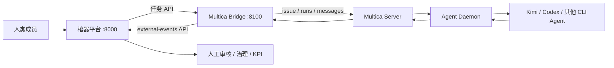

# Multica × 榕器 Agent 运行时桥接

这是独立于 `agent-platform/` 的执行控制平面桥接服务。榕器平台继续拥有企业组织、业务任务、人工审核、治理和 KPI；Multica 负责把任务交给 Kimi、Codex 等 CLI Agent 真实执行。

核心规则：**Multica 的 `done` 只能把榕器任务推进到“待审核”，最终“已通过”只能由人操作。**

完整的现状评估、方案对比、责任边界和演进路线见 [`ARCHITECTURE.md`](ARCHITECTURE.md)。

## 架构



桥接服务通过官方 `multica` CLI 访问 Multica，绑定、运行状态、幂等事件保存在自己的 `data/bridge.db`，不会写入 `agent-platform` 数据库。

## 启动

前提：

1. `agent-platform` 已运行于 `http://127.0.0.1:8000`；
2. 已安装并配置 Multica CLI，`multica auth status` 成功；
3. Multica daemon 在线，workspace 中已创建 Kimi/Codex Agent；
4. Python 已安装 `fastapi`、`uvicorn`。

```powershell
cd multica-platform
pip install -r requirements.txt
$env:MULTICA_WORKSPACE_ID="你的 workspace UUID"
$env:RONGQI_PERSON_ID="2"
python -m uvicorn app.main:app --host 127.0.0.1 --port 8100
```

也可以双击 `启动桥接器.bat`。生产或多人机器应设置 `RONGQI_API_TOKEN`，避免使用演示环境的 `person_id` 自动登录；同时设置 `BRIDGE_ADMIN_TOKEN`，写接口请求头携带 `X-Bridge-Token`。

## 首次联调

绑定榕器数字员工 `agent_id=1` 到 Multica Agent：

```http
PUT http://127.0.0.1:8100/api/bindings/1
Content-Type: application/json

{
  "external_agent_id": "Multica Agent UUID",
  "external_workspace_id": "Multica Workspace UUID",
  "enabled": true
}
```

把榕器任务 `task_id=25` 交给 Multica：

```http
POST http://127.0.0.1:8100/api/tasks/25/dispatch
```

桥接器每 30 秒自动同步，也可以手工触发：

```http
POST http://127.0.0.1:8100/api/sync
Content-Type: application/json

{"task_id": 25}
```

观察接口：

- `GET /health`：榕器 API、Multica CLI/认证状态；
- `GET /api/bindings`：数字员工映射；
- `GET /api/runs`：任务执行状态；
- `GET /api/events`：幂等事件与错误账本。

## 环境变量

| 变量 | 默认值 | 说明 |
|---|---|---|
| `RONGQI_API_URL` | `http://127.0.0.1:8000` | 榕器平台 API |
| `RONGQI_API_TOKEN` | 空 | 推荐生产设置 |
| `RONGQI_PERSON_ID` | `2` | 仅演示环境自动登录身份 |
| `MULTICA_CLI` | `multica` | CLI 可执行文件路径 |
| `MULTICA_PROFILE` | 空 | Multica profile |
| `MULTICA_WORKSPACE_ID` | 空 | 默认 workspace UUID |
| `MULTICA_TIMEOUT_SECONDS` | `45` | 单次 CLI 超时 |
| `BRIDGE_POLL_SECONDS` | `30` | 自动同步间隔 |
| `BRIDGE_AUTO_SYNC` | `true` | 是否自动同步 |
| `BRIDGE_ADMIN_TOKEN` | 空 | 非空时保护写接口 |

## 许可提醒

Multica 当前许可证允许单一组织内部使用；若把其源码或实质组件嵌入并作为面向第三方销售、许可或托管产品的组成部分，许可证要求取得商业授权。本实现不复制 Multica 源码，只做外部 CLI/API 互操作；正式对第三方商业交付前仍应完成法务确认和书面授权。
